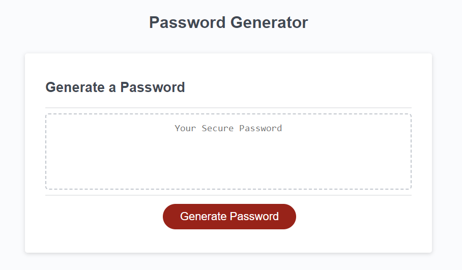

# challenge-3

## A password generator that is used to meet certain criterias and provides greater security.

## Technologies Used

*HTML
*CSS
*JavaScript

## Description

The JavaScript for this challenge already contained the event listener for the generate button that links to the id "generate" on the index.html as well as the writePassword function. 

I added the different types of character variables that will help produce the generated password and added pop up windows. 

The pop up windows ask the user for a desired length between 8-128 characters as well as if they want lowercase or uppercase, numbers, and or special characters. These values are put into an object called "userChoices" that holds all the information. 

Once the information is collected I seperated the true values from the false values based on the user's answers and combined all the characters for the true values by concatting them into the possibleCharacters variable. 

That variable runs through the for loop that randomizes the possible characters and chooses a letter one by one until it meats the desired character length.

Once all the characters meet the desired length requirement it becomes the value of password, which then gets loaded onto the webpages in the textarea that contains the id called "password". 

## Visuals
The following image shows how the already built password generator looks like.

## Setup/Installation Requirements

*Navigate to desired directory

*Clone the repository:
git clone https://uwisconsin.bootcampcontent.com/uwisconsin_coding_bootcamp/UofW-VIRT-FSF-PT-02-2023-U-LOLC.git

*Navigate to cloned repository

## Deployed Website Link
https://thoak90codes.github.io/challenge-3/ 

## Author & Contributors
UW Coding Bootcamp
@thoak90codes
